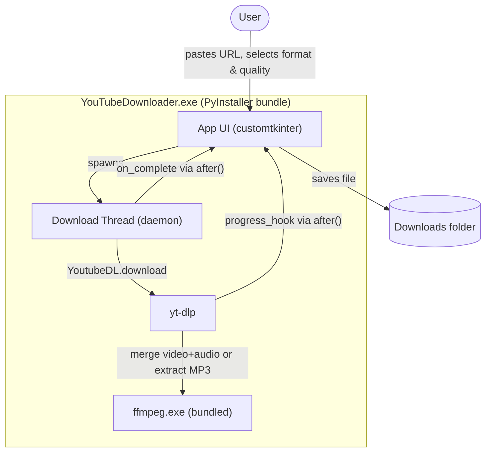
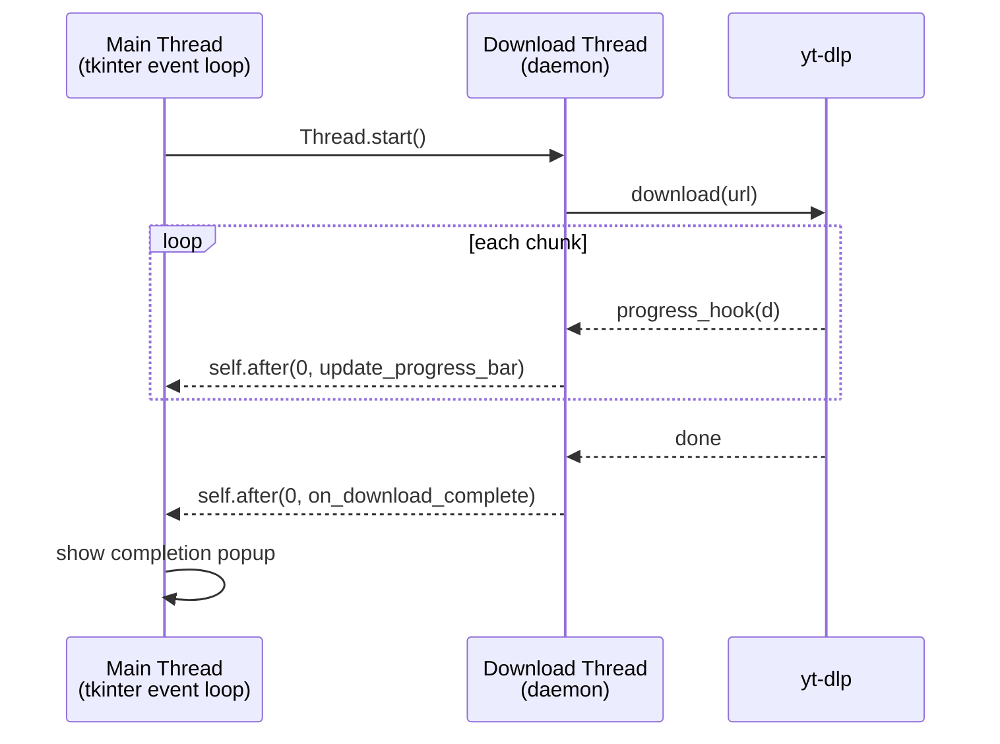
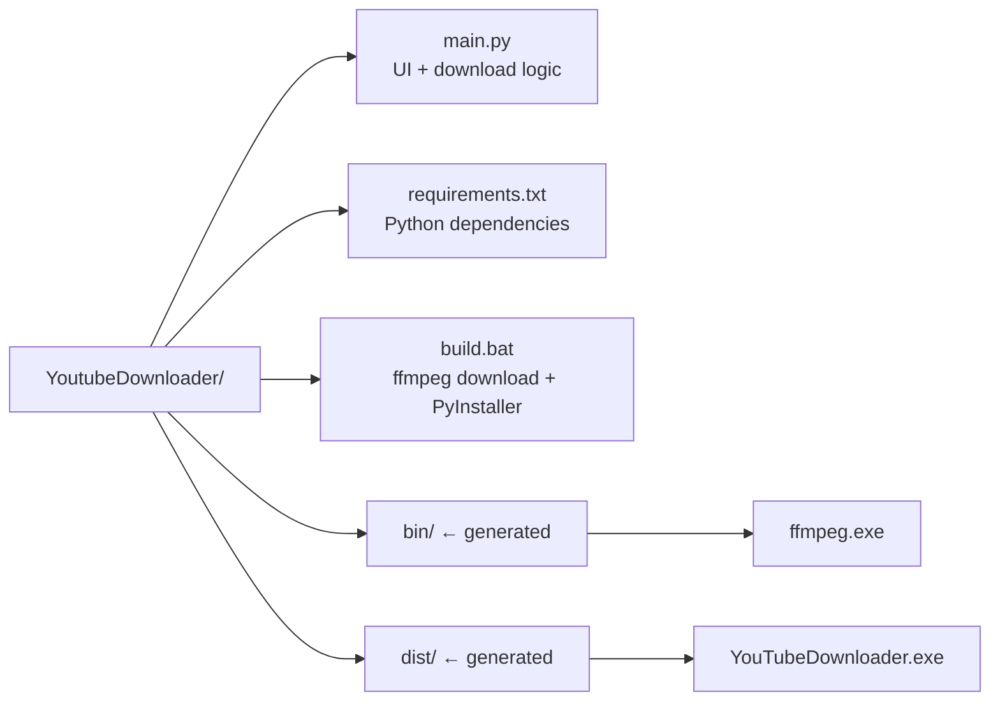

# YouTube Video Downloader

<div align="center">

<a href="https://github.com/BrunoGrifo/YoutubeDownloader/releases/latest/download/YouTubeDownloader.zip">
  
</a>

*Windows 10/11 x64 — no installation required*

</div>

> **Generated by [Claude](https://claude.ai) (claude-sonnet-4-6) using the Claude Code CLI.**

---

## Features

- Download YouTube videos as **MP4** (1080p, 720p, 480p) or **MP3** (192kbps)
- **Video + 1080p selected by default**
- Live progress bar with speed and ETA
- **Download** → saves directly to `~/Downloads`
- **Download As...** → choose filename and save location via file dialog
- Single portable `.exe` — no Python, no ffmpeg, no dependencies needed on the end user's machine

---

## How to Build

**Requirements:** Python 3.10+ installed on the build machine.

```bash
build.bat
```

The script will:
1. Install Python dependencies (`customtkinter`, `yt-dlp`, `pyinstaller`)
2. Download the ffmpeg static binary from GitHub
3. Bundle everything into `dist\YouTubeDownloader.exe`

---

## Architecture

### Component Overview



### Threading Model



### UI Layout

```
┌─────────────────────────────────────────────┐
│         YouTube Video Downloader            │
│  ┌───────────────────────────────────────┐  │
│  │  Paste YouTube URL here...            │  │
│  └───────────────────────────────────────┘  │
│          [ MP3 ]      [ Video ]             │
│       (●) 480p  ( ) 720p  ( ) 1080p        │
│  ▓▓▓▓▓▓▓▓▓▓▓▓▓░░░░░░░░░░░░░░░░░░░░░░░  45% │
│       Downloading...  2.3MB/s  ETA: 12s     │
│   ┌──────────────┐  ┌──────────────────┐   │
│   │   Download   │  │  Download As...  │   │
│   └──────────────┘  └──────────────────┘   │
└─────────────────────────────────────────────┘
```

### File Structure



---

## How It Was Made

### Plan

The goal was a self-contained Windows app that anyone could run without installing anything. The key challenges were:

1. **UI framework** — chose `customtkinter` for a modern dark-mode look on top of tkinter, which ships with Python and has no extra native dependencies.
2. **Download engine** — `yt-dlp` handles all YouTube extraction, format selection, and postprocessing. Format strings prefer `mp4+m4a` streams to avoid WebM output, with `merge_output_format=mp4` as a safety net.
3. **ffmpeg bundling** — yt-dlp needs ffmpeg to merge separate video+audio streams (required for 720p/1080p) and to convert to MP3. `build.bat` downloads a static Windows build at build time and PyInstaller bundles it into the `.exe`. At runtime the app resolves the path via `sys._MEIPASS`.
4. **Threading** — downloads run in a daemon thread so the UI stays responsive. All widget updates are routed back to the main thread via tkinter's `self.after(0, fn)` queue.
5. **Windows Defender workaround** — "Download As" downloads to a system temp folder first, lets yt-dlp complete all internal renames there, then moves the finished file to the user's chosen path. This prevents Defender from locking files mid-rename.
6. **Packaging** — PyInstaller `--onefile --windowed` produces a single portable `.exe` with the Python runtime, all packages, and ffmpeg embedded. `--collect-all customtkinter` is required to include its theme JSON files, without which the app crashes on launch.

### Stack

| Layer | Technology |
|---|---|
| UI | customtkinter 5.2.2 |
| Download engine | yt-dlp |
| Audio/video processing | ffmpeg (static binary) |
| Packaging | PyInstaller (--onefile) |
| Language | Python 3.10+ |

---

*Generated with [Claude Code](https://claude.ai/claude-code) — claude-sonnet-4-6*
