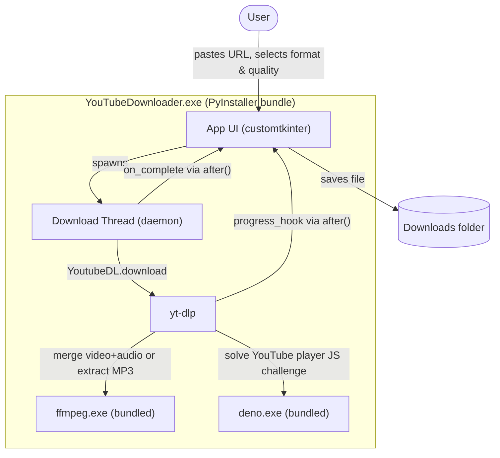
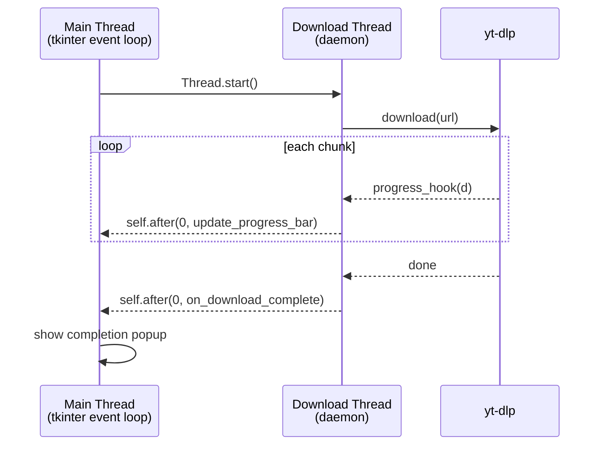
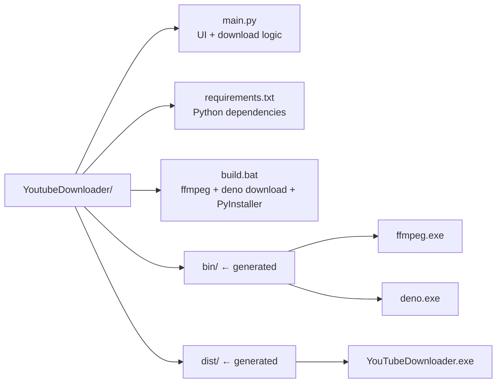

# YouTube Video Downloader

<div align="center">

<a href="https://github.com/BrunoGrifo/YoutubeDownloader/releases/latest/download/YouTubeDownloader.zip">
  
</a>

*Windows 10/11 x64 — no installation required*

</div>

> **Generated by [Claude](https://claude.ai) (claude-sonnet-4-6) using the Claude Code CLI.**

---

## Features

- Download YouTube videos as **MP4** (1080p, 720p, 480p) or **MP3** (192kbps)
- **Video + 1080p selected by default**
- Live progress bar with speed and ETA
- **Download** → saves directly to `~/Downloads`
- **Download As...** → choose filename and save location via file dialog
- Single portable `.exe` — no Python, no ffmpeg, no dependencies needed on the end user's machine

---

## Development Setup

**Requirements:** Python 3.10+ installed. The shipped `.exe` is Windows-only, but
you can run and develop the app from source on macOS/Linux too.

### 1. Create the virtual environment

```powershell
# Windows (PowerShell)
python -m venv .venv
```

```bash
# macOS / Linux
python3 -m venv .venv
```

### 2. Activate it

```powershell
# Windows – PowerShell
.\.venv\Scripts\Activate.ps1

# Windows – cmd.exe
.\.venv\Scripts\activate.bat
```

```bash
# macOS / Linux (bash/zsh)
source .venv/bin/activate
```

If PowerShell blocks the activation script, run once:
`Set-ExecutionPolicy -Scope CurrentUser RemoteSigned`

### 3. Install the requirements

```powershell
# Windows
python -m pip install --upgrade pip
python -m pip install -r requirements.txt
```

```bash
# macOS / Linux
python3 -m pip install --upgrade pip
python3 -m pip install -r requirements.txt
```

### 4. Run the app from source

```powershell
# Windows
python main.py
```

```bash
# macOS / Linux
python3 main.py
```

---

## How to Build the .exe

**Double-click `build.bat`** in File Explorer (or run `.\build.bat` from a
terminal). No arguments needed.

> Activate the virtual environment first (step 2 above) so `build.bat` installs
> into `.venv` rather than your global Python. If you double-click it without an
> active venv, it uses whatever `python` is on your `PATH`.

The script runs 5 steps:
1. Install Python dependencies and upgrade `yt-dlp` to the latest release
2. Download the ffmpeg static binary from GitHub → `bin\ffmpeg.exe`
3. Download the Deno JS runtime from GitHub → `bin\deno.exe`
4. Bundle everything into `dist\YouTubeDownloader.exe` (PyInstaller)
5. Package the exe into `dist\YouTubeDownloader.zip` (the release asset)

> **Keep yt-dlp fresh.** YouTube changes its player regularly and breaks older
> yt-dlp versions (symptom: `HTTP Error 403: Forbidden`). Rebuild and re-release
> whenever downloads start failing — `build.bat` always pulls the newest yt-dlp.

### Building on macOS / Linux

`build.bat` is Windows-only, and PyInstaller cannot cross-compile — a build on
macOS produces a macOS binary, not a Windows `.exe`. The **released**
`YouTubeDownloader.zip` must be built on Windows.

To produce a local macOS/Linux build for yourself, run the equivalent steps by
hand from an activated venv:

```bash
# 1. deps (+ newest yt-dlp)
python3 -m pip install -r requirements.txt
python3 -m pip install --upgrade yt-dlp

# 2. ffmpeg  — macOS: `brew install ffmpeg`  |  Linux: `sudo apt install ffmpeg`
mkdir -p bin
cp "$(command -v ffmpeg)" bin/ffmpeg.exe

# 3. Deno JS runtime (needed or YouTube returns HTTP 403)
curl -fsSL https://deno.land/install.sh | sh   # then: cp ~/.deno/bin/deno bin/deno.exe

# 4. bundle
python3 -m PyInstaller --onefile --windowed --name YouTubeDownloader \
  --add-data "bin/ffmpeg.exe:bin" \
  --add-data "bin/deno.exe:bin" \
  --collect-all customtkinter \
  main.py

# 5. package
(cd dist && zip YouTubeDownloader-macos.zip YouTubeDownloader)
```

> The `--add-data` separator is `:` on macOS/Linux vs `;` on Windows.
> `main.py` currently hardcodes the bundled binary names as `ffmpeg.exe` /
> `deno.exe` (`get_ffmpeg_path` / `get_deno_path`), so on macOS/Linux either copy
> the binaries into `bin/` under those `.exe` names as shown above, or change
> those two functions to be OS-aware first.

---

## How to Release a New Version

The download button at the top of this README links to:

```
https://github.com/BrunoGrifo/YoutubeDownloader/releases/latest/download/YouTubeDownloader.zip
```

GitHub resolves `latest` to the newest **non-prerelease, non-draft** release, and
`YouTubeDownloader.zip` must be an **asset attached to that release** with exactly
that filename. So to make the button serve a new build:

1. **Build** — double-click `build.bat`. Confirm `dist\YouTubeDownloader.zip` exists.
2. **Bump the version** — update the tag you're about to create (e.g. `v1.2.0`)
   and mention the changes. Keep [`requirements.txt`](requirements.txt) pinned to
   the yt-dlp version you actually built with if you want reproducibility.
3. **Commit & push** any source changes to `main`.
4. **Create the tag and release** (GitHub CLI):

   ```powershell
   gh release create v1.2.0 dist\YouTubeDownloader.zip `
     --title "v1.2.0" `
     --notes "What changed in this release"
   ```

   Or, if the tag already exists / you prefer the web UI: GitHub → Releases →
   *Draft a new release* → choose the tag → drag `dist\YouTubeDownloader.zip`
   into the assets box → **Publish** (not "Save draft").

5. **Verify** — open the download URL above in a browser. It should download the
   new zip. Also check `gh release view --web` shows the zip asset and the
   release is marked **Latest**.

### Updating an existing release's asset

If you only rebuilt the exe (e.g. a yt-dlp refresh) and want to reuse the same
version tag:

```powershell
gh release upload v1.2.0 dist\YouTubeDownloader.zip --clobber
```

`--clobber` replaces the existing asset of the same name.

---

## Architecture

### Component Overview


```mermaid
graph TD
    User([User]) -->|"pastes URL, selects format & quality"| UI

    subgraph exe["YouTubeDownloader.exe (PyInstaller bundle)"]
        UI["App UI (customtkinter)"]
        DL["Download Thread (daemon)"]
        YTDLP["yt-dlp"]
        FFMPEG["ffmpeg.exe (bundled)"]
        DENO["deno.exe (bundled)"]
    end

    UI -->|spawns| DL
    DL -->|YoutubeDL.download| YTDLP
    YTDLP -->|"merge video+audio or extract MP3"| FFMPEG
    YTDLP -->|"solve YouTube player JS challenge"| DENO
    YTDLP -->|"progress_hook via after()"| UI
    DL -->|"on_complete via after()"| UI
    UI -->|saves file| Disk[(Downloads folder)]
```

### Threading Model


```mermaid
sequenceDiagram
    participant Main as Main Thread<br/>(tkinter event loop)
    participant Thread as Download Thread<br/>(daemon)
    participant YTDLP as yt-dlp

    Main->>Thread: Thread.start()
    Thread->>YTDLP: download(url)

    loop each chunk
        YTDLP-->>Thread: progress_hook(d)
        Thread-->>Main: self.after(0, update_progress_bar)
    end

    YTDLP-->>Thread: done
    Thread-->>Main: self.after(0, on_download_complete)
    Main->>Main: show completion popup
```

### UI Layout

```
┌─────────────────────────────────────────────┐
│         YouTube Video Downloader            │
│  ┌───────────────────────────────────────┐  │
│  │  Paste YouTube URL here...            │  │
│  └───────────────────────────────────────┘  │
│          [ MP3 ]      [ Video ]             │
│       (●) 480p  ( ) 720p  ( ) 1080p        │
│  ▓▓▓▓▓▓▓▓▓▓▓▓▓░░░░░░░░░░░░░░░░░░░░░░░  45% │
│       Downloading...  2.3MB/s  ETA: 12s     │
│   ┌──────────────┐  ┌──────────────────┐   │
│   │   Download   │  │  Download As...  │   │
│   └──────────────┘  └──────────────────┘   │
└─────────────────────────────────────────────┘
```

### File Structure


```mermaid
graph LR
    root["YoutubeDownloader/"]
    root --> main["main.py\nUI + download logic"]
    root --> req["requirements.txt\nPython dependencies"]
    root --> bat["build.bat\nffmpeg + deno download + PyInstaller"]
    root --> bin["bin/  ← generated"]
    root --> dist["dist/  ← generated"]
    bin --> ffmpeg["ffmpeg.exe"]
    bin --> deno["deno.exe"]
    dist --> exe["YouTubeDownloader.exe"]
```

---

## How It Was Made

### Plan

The goal was a self-contained Windows app that anyone could run without installing anything. The key challenges were:

1. **UI framework** — chose `customtkinter` for a modern dark-mode look on top of tkinter, which ships with Python and has no extra native dependencies.
2. **Download engine** — `yt-dlp` handles all YouTube extraction, format selection, and postprocessing. Format strings prefer `mp4+m4a` streams to avoid WebM output, with `merge_output_format=mp4` as a safety net.
3. **ffmpeg bundling** — yt-dlp needs ffmpeg to merge separate video+audio streams (required for 720p/1080p) and to convert to MP3. `build.bat` downloads a static Windows build at build time and PyInstaller bundles it into the `.exe`. At runtime the app resolves the path via `sys._MEIPASS`.
4. **Deno bundling** — since mid-2026 YouTube requires solving a JavaScript player challenge; yt-dlp needs a JS runtime for this or downloads fail with `HTTP 403 Forbidden`. `build.bat` downloads `deno.exe` and the app passes it to yt-dlp via `js_runtimes={"deno": {"path": ...}}`.
4. **Threading** — downloads run in a daemon thread so the UI stays responsive. All widget updates are routed back to the main thread via tkinter's `self.after(0, fn)` queue.
5. **Windows Defender workaround** — "Download As" downloads to a system temp folder first, lets yt-dlp complete all internal renames there, then moves the finished file to the user's chosen path. This prevents Defender from locking files mid-rename.
6. **Packaging** — PyInstaller `--onefile --windowed` produces a single portable `.exe` with the Python runtime, all packages, and ffmpeg embedded. `--collect-all customtkinter` is required to include its theme JSON files, without which the app crashes on launch.

### Stack

| Layer | Technology |
|---|---|
| UI | customtkinter 5.2.2 |
| Download engine | yt-dlp |
| Audio/video processing | ffmpeg (static binary) |
| Packaging | PyInstaller (--onefile) |
| Language | Python 3.10+ |

---

*Generated with [Claude Code](https://claude.ai/claude-code) — claude-sonnet-4-6*
